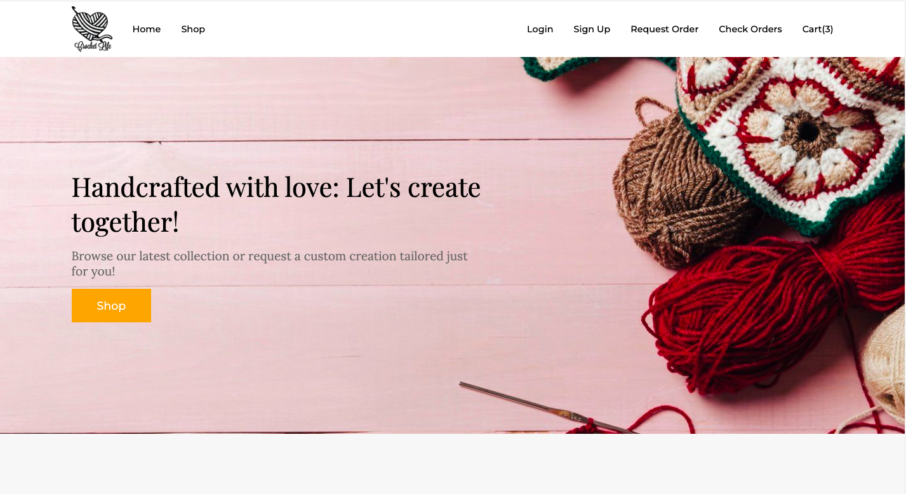
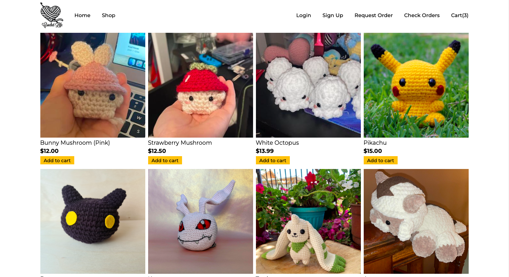
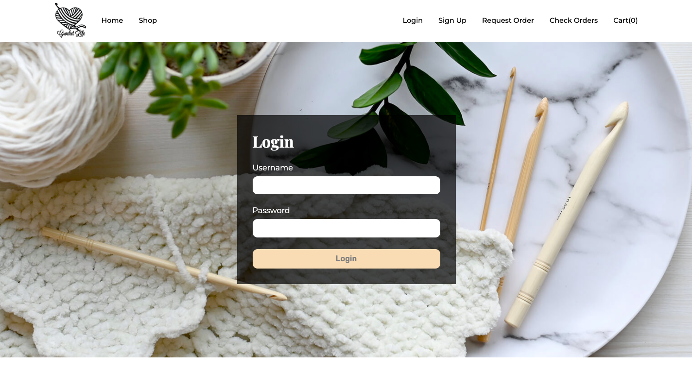
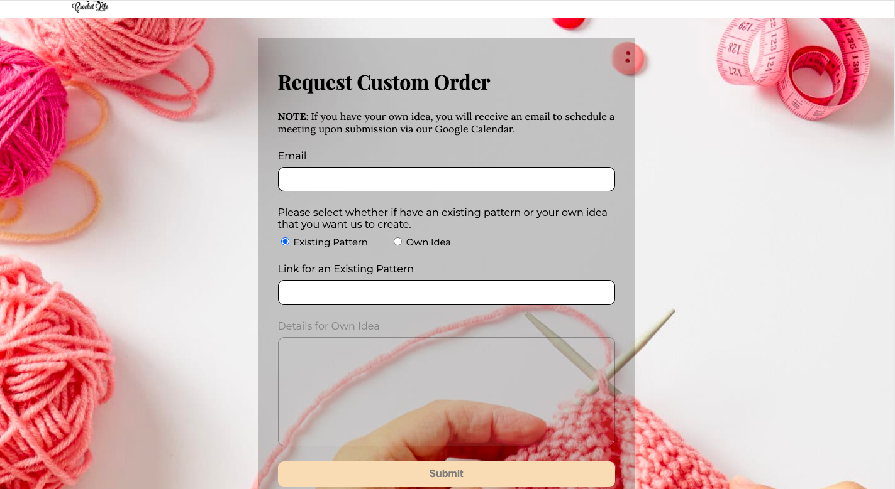
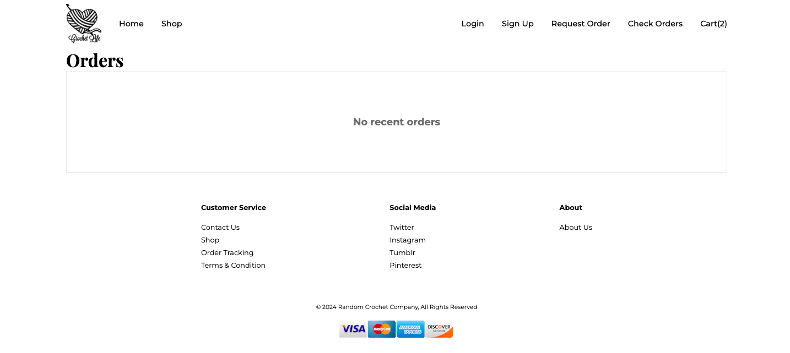
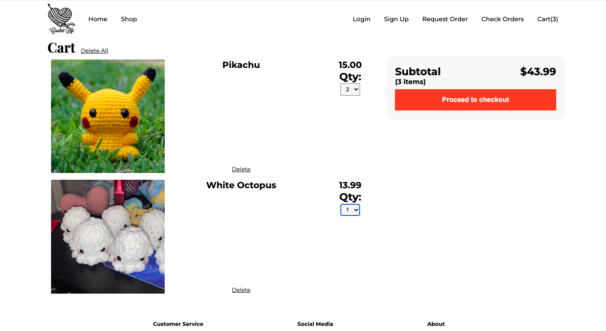

# Crochet Shop Application
<a id="readme-top"></a>

<!-- TABLE OF CONTENTS -->
<details>
  <summary>Table of Contents</summary>
  <ol>
    <li>
      <a href="#about">About</a>
      <ul>
        <li><a href="#demo">Demo</a></li>
        <li><a href="#built-with">Built With</a></li>
      </ul>
    </li>
    <li>
      <a href="#installation---getting-started">Installation - Getting Started</a>
    </li>
    <li><a href="#current-features">Current Features</a></li>
    <li><a href="#future-improvements">Future Improvements</a></li>
    <li><a href="#acknowledgments">Acknowledgments</a></li>
  </ol>
</details>


<!-- ABOUT THE PROJECT -->
## About
The Crochet Shop web app is a functional prototype e-commerce platform designed for selling handmade crochet items online. Users can browse products, add items to their cart, and update quantities.

While it doesn’t yet include features like checkout, user accounts, or payment integration, the app demonstrates the core shopping experience and responsive design for both desktop and mobile devices.

The idea for this project came from a friend who hopes to start a crochet business in the future. I built this prototype app for her, should she wish to use it as a starting point for her online shop.

### Demo
- **Live Demo:** [View app](https://crochet-shop-site.onrender.com/)  
   - **NOTE: Hosting uses free tier, so may take a few seconds to 1 minute for the initial load**. If waiting for the live demo might be inconvenient, feel free to view the video or expand the screenshots below.
- **Video Demo:** [Watch a walkthrough](https://github.com/user-attachments/assets/5581fae1-de47-4963-b3bb-6160cd4d939b)

- **Screenshot Demo**:
   <details>
   <summary>Click to expand screenshots</summary>

   ### Home
   

   ### Shop
   

   ### Login
   

   ### Custom Request
   

   ### Check Order
   

   ### Cart
   

   </details>

### Built With
- **Languages:** Python, JavaScript, HTML, CSS
- **Backend**: Flask, Flask-SocketIO
- **Database**: SQLite
- **Deployment / Server**: Gunicorn, Gevent
- **Hosting**: Render

<p align="right">(<a href="#readme-top">back to top</a>)</p>


<!-- GETTING STARTED -->
## Installation - Getting Started

To get a local copy up and running, follow these steps:

1. Clone the repo
   ```sh
   git clone https://github.com/dnce17/crochet_shop_site.git
   ```
2. Navigate into the project folder
   ```sh
   cd <project-folder>
   ```
3. Create a virtual environment (venv)
   ```sh
   python3 -m venv .venv
   ```
4. Activate venv
   ```sh
   source .venv/bin/activate
   ```
5. Install the required packages
   ```sh
   pip install -r requirements.txt
   ```
6. Run the development server
   ```sh
   flask run --debug
   ```

<p align="right">(<a href="#readme-top">back to top</a>)</p>


<!-- FEATURE EXAMPLES -->
## Current Features
- Browse items in the shop
- Add items to cart
- Update quantity in the cart
- Remove items from cart
- Responsive design – works on both desktop and mobile devices

<p align="right">(<a href="#readme-top">back to top</a>)</p>


## Future Improvements
1. **Quantity selection** – in the shop, allow users to choose the quantity of each item before adding it to the cart
2. **Individual item totals** – in the cart, display the total price of each individual item based on the selected quantity
3. **Admin page** – provide a dedicated page where owner can manage inventory, update stock, and track custom order requests

<p align="right">(<a href="#readme-top">back to top</a>)</p>


## Acknowledgments 

**Special Thanks**  
- Thank you to my friend for providing images of some of her crochet work

**Web Design Inspiration**  
- [Colorlib](https://colorlib.com/wp/flower-website-templates/)

**Image Sources**  
- [Freepik – Wool Elements Banner](https://www.freepik.com/free-photo/wool-elements-space-right_1322135.htm#query=crochet%20banner&position=0&from_view=keyword&track=ais_user&uuid=9ad94ce4-144f-46fd-b367-3367750d1cff)  
- [KnitPro – Bamboo Crochet](https://www.knitpro.eu/a/bamboo-crochet/en)  
- [Soldenoche de Crochet – Workspace Setup](https://soldenochedecocrochet.blogspot.com/2015/11/creating-your-ideal-workspace.html)  
- [53 Stitches – Pikachu Pattern](https://53stitches.com/pikachu/)  
- [Ravelry – Botamon Digimon Pattern](https://www.ravelry.com/patterns/library/botamon-digimon)  
- [Reddit – Koromon Amigurumi](https://www.reddit.com/r/Amigurumi/comments/u0702t/koromon_from_digimon_i_think_im_finally_getting/)  
- [Pinterest – Crochet Pattern](https://www.pinterest.com/pin/457115430942991759/)  
- [1Up Crochet – Gomamon Pattern](https://www.1upcrochet.com/www1upcrochetcom/old-patterns//2018/02/digimon-gomamon-amigurumi-pattern.html)

**Resources That Helped Solve Issues**  
- [Stack Overflow – Modify Flask session inside SocketIO event](https://stackoverflow.com/questions/55793579/is-there-a-way-to-modify-a-flask-session-inside-a-flask-socketio-event)  
- [GeeksforGeeks – Using Flask session in Python](https://www.geeksforgeeks.org/how-to-use-flask-session-in-python-flask/)  
- [GeeksforGeeks – Align element to bottom with Flexbox](https://www.geeksforgeeks.org/how-to-align-an-element-to-bottom-with-flexbox-in-css/)  
- [Stack Overflow – Remove all child elements of a DOM node](https://stackoverflow.com/questions/3955229/remove-all-child-elements-of-a-dom-node-in-javascript)  
- [Stack Overflow – SQLite3 ProgrammingError: Incorrect number of bindings](https://stackoverflow.com/questions/16856647/sqlite3-programmingerror-incorrect-number-of-bindings-supplied-the-current-sta)

<p align="right">(<a href="#readme-top">back to top</a>)</p>
